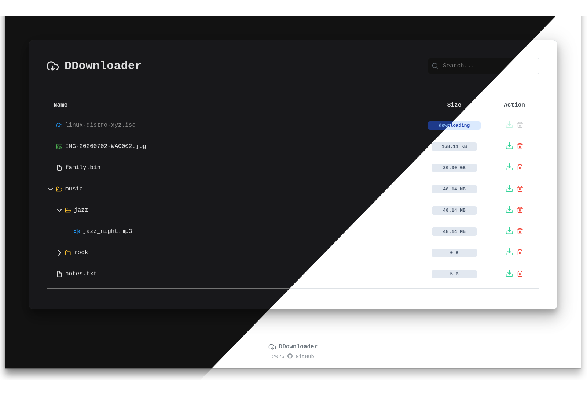

<div align="center">
  <h1>DDownloader</h1>

<p>
  A simple, fast, and lightweight web UI to browse and download files from a specific directory, 
  with optional Transmission integration to watch files being downloaded.
</p>

</div>




## Features


### Core
- Ultra-lightweight - ~13 MB on disk, ~4 MB RAM
- Recursive directory exploration
- Visual file type identification (videos, images, PDFs, archives)
- Responsive and clean UI
- Docker-ready

### Optional
- Transmission integration to list active downloads


## Usage

DDownloader is designed to run inside a container and expose a specific
directory. Transmission integration is optional and
can be configured using environment variables.

### Running with Docker

1. Build the Docker compose :
   ```yaml
   services:
      ddownloader:
         image: moixblau/ddownloader:latest
         container_name: ddownloader-app
         ports:
            - "3000:3000"
         environment:
            - TRANSMISSION_HOST: "localhost:9090"
            - TRANSMISSION_USERNAME: "username"
            - TRANSMISSION_PASSWORD: "password"
         volumes:
            - /volume1/downloads/complete:/data
         restart: unless-stopped
      ```

### Optional Parameters

- `THEME` – set to `light` to enable light mode (default: `dark`)

## Built With

- **Go** – backend and server
- **htmx** – for dynamic HTML interactions
- **PrimeFlex** – CSS utility classes ([link](https://github.com/primefaces/primeflex))
- **PrimeIcons** – icon set ([link](https://github.com/primefaces/primeicons))
